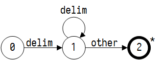
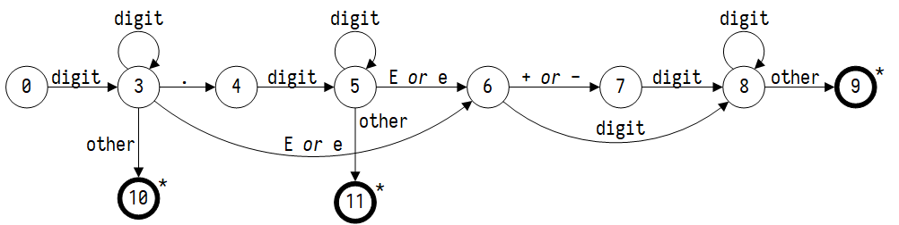
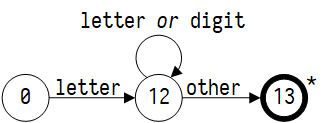
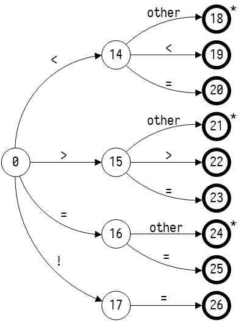
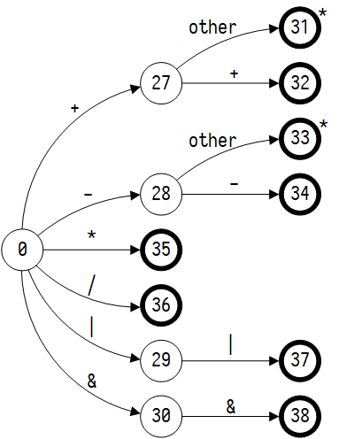
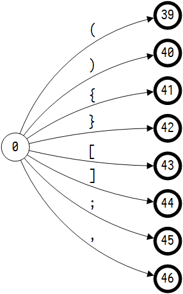
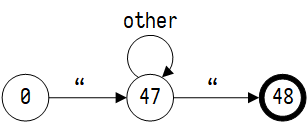

# 词法分析实验

本次实验选择 C 的子集 Mini-C 构造一个词法分析器

## C11 规范

C11 规范来自于 [cppreference.com](http://en.cppreference.com) 中所列举的 C 语言
结构描述。Mini-C 从中选取了常用的关键字来构成 C 语言的子集，包括数字、常用的数据
类型、条件控制语句、For 循环、和常见的运算操作符与函数调用。本次报告的示例程序如
下所示。

```c
// filename: test.mini
int main(int argc, char* args[])
{
    int count = 1;
    for (unsigned int i = 0; i < argc; i++)
    {
        if (i == 0)
            printf("%s\n", args[i]);
        else
            printf("%d:\t%s", count, args[i]);
        count++;
    }
    return 0;
}
```

## Mini-C 正规式描述

参照 C11 规范，我们得到 Mini-C 的词法正规式。

```
delim       [ \t\n]
ws          {delim}+
digit       [0-9]
digits      {digit}+
number      {digits}(\.{digits})?([Ee][+-]?{digits})?
symbol      "("|")"|"{"|"}"|";"|"["|"]"|","
letter_     [A-Za-z\_]
id          {letter_}({letter_}|{digit})*
str         \"[^\"]*\"
comparison  "<"|">"|"<="|">="|"=="|"!="
operator    "+"|"-"|"*"|"/"|"="|"++"|"--"|"<<"|">>"|"||"|"&&"
```

有一些简单的正则表达式模式，比如 if。如果我们在输入中看到两个字母 if，并且 if 之
后没有跟随其他字母和数字，就会返回词法单元 IF。这样的保留字我们用一个保留字表来
维持，在获得词素之后参照保留字来判断词法单元是什么。其他关键字处理方式与之类似。

```
main if then else for void char int signed unsigned return
```

## 最小化 DFA

### 正则表达式转化为 NFA

表头为 ASCII 码真值，表项为状态机标号。















| ASCII | 0   | 1   | 2   | 3   | 4   | 5   | 6   | 7   |
| ----- | --- | --- | --- | --- | --- | --- | --- | --- |
| 00H   |     |     |     |     |     |     |     |     |
| 01H   |     |     |     |     |     |     |     |     |
| 02H   |     |     |     |     |     |     |     |     |
| 03H   |     |     |     |     |     |     |     |     |
| 04H   |     |     |     |     |     |     |     |     |
| 05H   |     |     |     |     |     |     |     |     |
| 06H   |     |     |     |     |     |     |     |     |
| 07H   |     |     |     |     |     |     |     |     |
| 08H   |     |     |     |     |     |     |     |     |
| 09H   |     |     |     |     |     |     |     |     |
| 0AH   |     |     |     |     |     |     |     |     |
| 0BH   |     |     |     |     |     |     |     |     |
| 0CH   |     |     |     |     |     |     |     |     |
| 0DH   |     |     |     |     |     |     |     |     |
| 0EH   |     |     |     |     |     |     |     |     |
| 0FH   |     |     |     |     |     |     |     |     |
